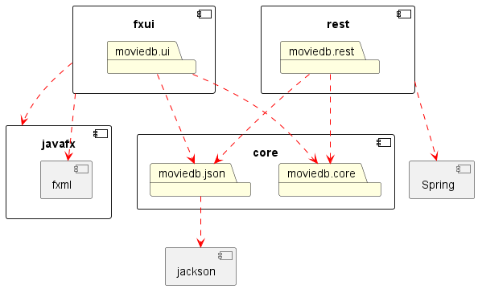
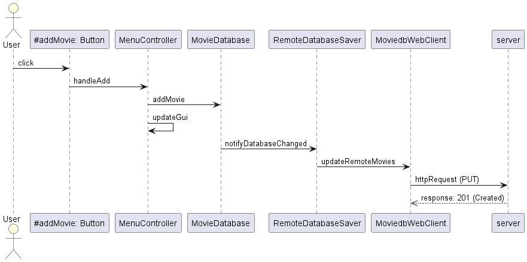
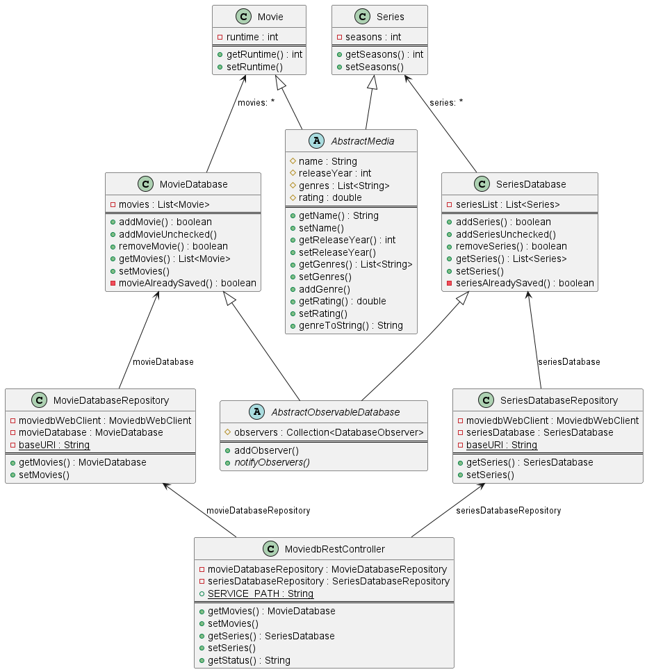

# Moviedb-prosjektet

## Oppbygning

- Prosjektet er bygget med Maven, og bruker JavaFX for å vise et grensesnitt.
- Hovedklassene for prosjektet ligger under **moviedb/src/core/main/java/moviedb/core**.
  - Prosjektet består av fire hovedklasser, [Movie](moviedb/core/src/main/java/moviedb/core/Movie.java), [MovieDatabase](moviedb/core/src/main/java/moviedb/core/MovieDatabase.java), [Series](moviedb/core/src/main/java/moviedb/core/Series.java) og [SeriesDatabase](moviedb/core/src/main/java/moviedb/core/SeriesDatabase.java).java.
  - Movie og Series arver fra den abstrakte klassen [AbstractMedia](moviedb/core/src/main/java/moviedb/core/AbstractMedia.java).
  - MovieDatabase og SeriesDatabase arver fra den abstrakte klassen [AbstractObsrvableDatabase](moviedb/core/src/main/java/moviedb/core/AbstractObservableDatabase.java).
  - Hver MovieDatabase og SeriesDatabase har én eller flere [DatabaseObserver](moviedb/core/src/main/java/moviedb/core/DatabaseObserver.java)-ere, enten en [LocalDatabaseSaver](moviedb/core/src/main/java/moviedb/core/LocalDatabaseSaver.java) eller en [RemoteDatabaseSaver](moviedb/core/src/main/java/moviedb/core/RemoteDatabaseSaver.java),  
    som oppdaterer json-fila (Local) og serveren (Remote), dersom serveren kjører, når det skjer en endring i databasen.
- For å kjøre grensesnittet brukes [App](moviedb/fxui/src/main/java/moviedb/ui/App.java), og for å behandle logikken brukes [MenuController](moviedb/fxui/src/main/java/moviedb/ui/MenuController.java) og [MediaController](moviedb/fxui/src/main/java/moviedb/ui/MediaController.java).
- Testene for hovedklassene ligger under **moviedb/src/test/java/moviedb/core**.
- Testene for grensesnittet ligger under **moviedb/fxui/src/test/java/moviedb/ui**.
- I tillegg bruker prosjektet lesing og skriving til fil, dette gjøres vha. movies.json- eller series.json-fila i **{user.home}/moviedbfx/persistence**,  
  for henholdsvis filmer og serier.  
  Når appen åpnes for første gang opprettes de nødvendige mappene og tomme json-filer på brukerens datamaskin.
  Når brukeren legger inn en ny film/serie oppdateres den tilhørende json-filen.
  Klassene som styrer fillagringen ligger i **moviedb/json**-pakken.  
  Dersom serveren kjører forsøker appen å hente databasen fra serveren når brukeren åpner appen.  
  Klassene som styrer kommunikasjon med serveren ligger i **moviedb/rest**-pakken, med unntak av [MoviedbWebClient](moviedb/core/src/main/java/moviedb/core/MoviedbWebClient.java), som ligger i **moviedb/core**-pakken.  
  Når brukeren gjør en endring varsles serveren om dette, og oppdaterer innholdet.

Formatet for fillagring er som følger:

<pre><code>{  
    "movies": [ {  
        "name" : "navn_1"  
        "releaseYear" : utgivelsesår_1  
        "genre(s)" :  [ "sjanger_1", "sjanger_2", ... , "sjanger_n"],  
        "runtime" : spilletid_1  
        "rating" : vurdering_1
    }, {  
        "name" : "navn_2"  
        "releaseYear" : 'utgivelsesår_2'  
        "genre(s)" :  [ "sjanger_1", "sjanger_2", ... , "sjanger_n"],  
        "runtime" : spilletid_2' 
        "rating" : vurdering_2
    } ]
}</code></pre>

For serier er formatet noenlunde det samme, der den eneste forskjellen er at "runtime"-feltet er byttet ut med "seasons".

## Skjermdumper fra kjørende applikasjon

## Bygging og kjøring av prosjektet

For å bygge, kjør `mvn clean install` fra rot-mappa til prosjektet (moviedb-mappa).  
**NB!** Det er imperativt at akkurat denne kommandoen kjøres.  
Dette vil kjøre alle enhetstester, samt sjekker med SpotBugs og Checkstyle.
Dersom det ikke er ønskelig å kjøre testene kan man legge til flagget `-DskipTests` på slutten av kommandoen.  
Dersom det er ønskelig å kjøre testene for én bestemt modul,  
kan dette gjøres enten med kommandoen `mvn verify` eller `mvn test` fra den tilhørende modul-mappa (**moviedb/{modul-navn}**).
Rapporter for testdekningsgrad vil genereres under **moviedb/core/target/site/jacoco**.

Appen kan kjøres vha. [App](moviedb/fxui/src/main/java/moviedb/ui/App.java)-klassen, eller via kommandoen `mvn javafx:run`.  
Appen har to forskjellige former for lagring. Den forsøker først å koble seg opp til serveren. Dersom serveren svarer,  
hentes den eksisterende databasen fra serveren, og lagringen av alle fremtidige endringer vil også sendes til serveren.  
Dersom den ikke svarer, "defaulter" appen til lokal lagring.

**NB!** Dersom man skal starte appen ved å kjøre en kommando, må dette gjøres i mappa til fxui-modulen. I tillegg må fxui-modulen  
og dens avhengigheter allerede være installert. Dvs. fxui og core må være installert dersom man skal kjøre den lokale varianten,  
of fxui, core og rest må være installert dersom man skal kjøre den på serveren.  
**OBS!** Her må også serveren kjøre, noe som gjøres ved å kjøre kommandoen `mvn spring-boot:run` i rest-modulen.

## Hvordan "shippe" prosjektet

For å "shippe" prosjektet brukes kommandoen `mvn clean compile javafx:jlink` fra fxui-modulen.  
Dette vil lage en .zip-fil av prosjektet med navn **moviedbfx.zip** under **moviedb/fxui/target/**.
Deretter kan man kjøre `mvn jpackage:jpackage`, som vil lage en .exe-fil med navn **MovieDBFX-1.0.0.exe** under **moviedb/fxui/target/dist/**.
Dersom man starter denne .exe-fila vil appen installeres på brukerens datamaskin. Det er kun den lokale varianten av appen  
som kan installeres på maskinen.

## Arkitektur diagram

